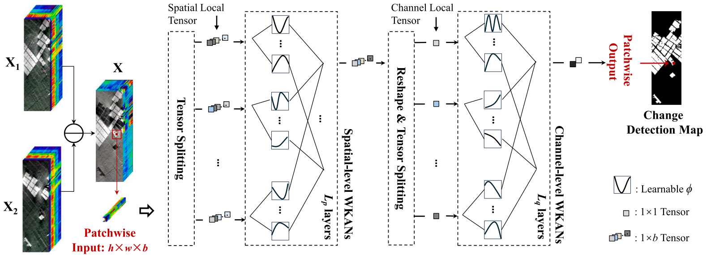

# SpectralKAN: Weighted Activation Distribution Kolmogorov–Arnold Network for Hyperspectral Image Change Detection
The code in this toolbox implements the ["SpectralKAN: Weighted Activation Distribution Kolmogorov–Arnold Network for Hyperspectral Image Change Detection"](https://www.sciencedirect.com/science/article/pii/S0031320326000051). 

Citation
---------------------

**Please kindly cite the papers if this code is useful and helpful for your research.**

    @article{wang2026spectralkan,
      title={SpectralKAN: Weighted Activation Distribution Kolmogorov--Arnold Network for Hyperspectral Image Change Detection},
      author={Wang, Yanheng and Yu, Xiaohan and Gao, Yongsheng and Sha, Jianjun and Wang, Jian and Yan, Shiyong and Qin, Kai and Zhang, Yonggang and Gao, Lianru},
      journal={Pattern Recognition},
      pages={113042},
      year={2026},
      doi={https://doi.org/10.1016/j.patcog.2026.113042}
      publisher={Elsevier}
    }
    
    
How to use it?
---------------------
Run `python demo.py --dataset='farmland'` for training, and run `python test_new.py` for testing and obtaining the change detection results.

Licensing
---------

MIT License

Copyright (c) 2026 yanhengwang-heu

Permission is hereby granted, free of charge, to any person obtaining a copy
of this software and associated documentation files (the "Software"), to deal
in the Software without restriction, including without limitation the rights
to use, copy, modify, merge, publish, distribute, sublicense, and/or sell
copies of the Software, and to permit persons to whom the Software is
furnished to do so, subject to the following conditions:

The above copyright notice and this permission notice shall be included in all
copies or substantial portions of the Software.

THE SOFTWARE IS PROVIDED "AS IS", WITHOUT WARRANTY OF ANY KIND, EXPRESS OR
IMPLIED, INCLUDING BUT NOT LIMITED TO THE WARRANTIES OF MERCHANTABILITY,
FITNESS FOR A PARTICULAR PURPOSE AND NONINFRINGEMENT. IN NO EVENT SHALL THE
AUTHORS OR COPYRIGHT HOLDERS BE LIABLE FOR ANY CLAIM, DAMAGES OR OTHER
LIABILITY, WHETHER IN AN ACTION OF CONTRACT, TORT OR OTHERWISE, ARISING FROM,
OUT OF OR IN CONNECTION WITH THE SOFTWARE OR THE USE OR OTHER DEALINGS IN THE
SOFTWARE.
